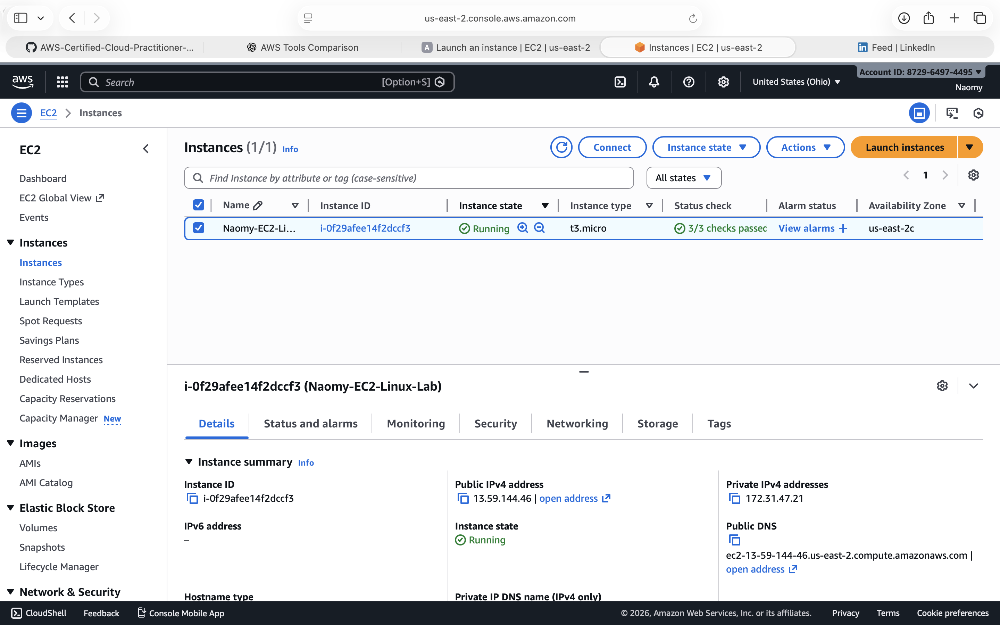
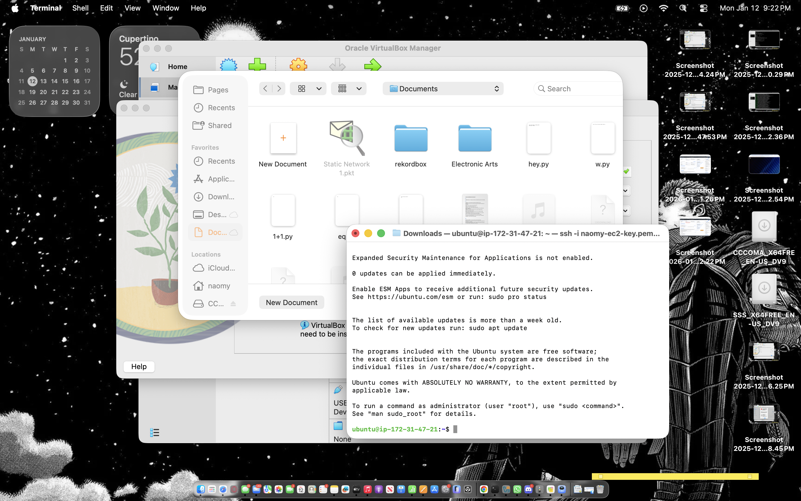
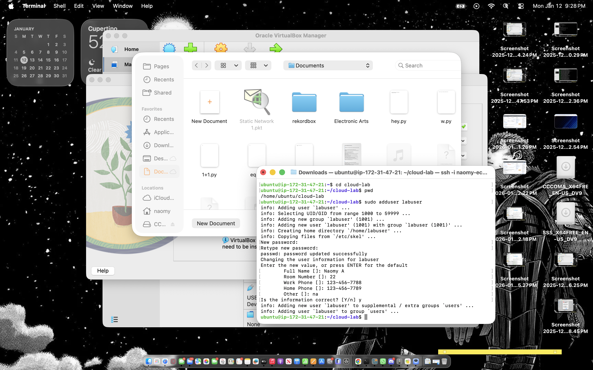
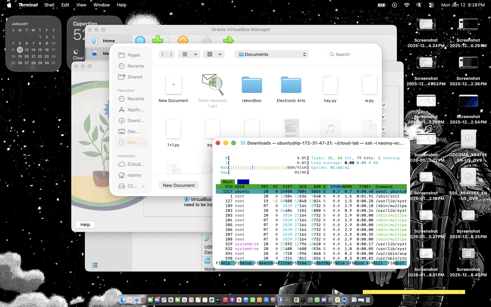
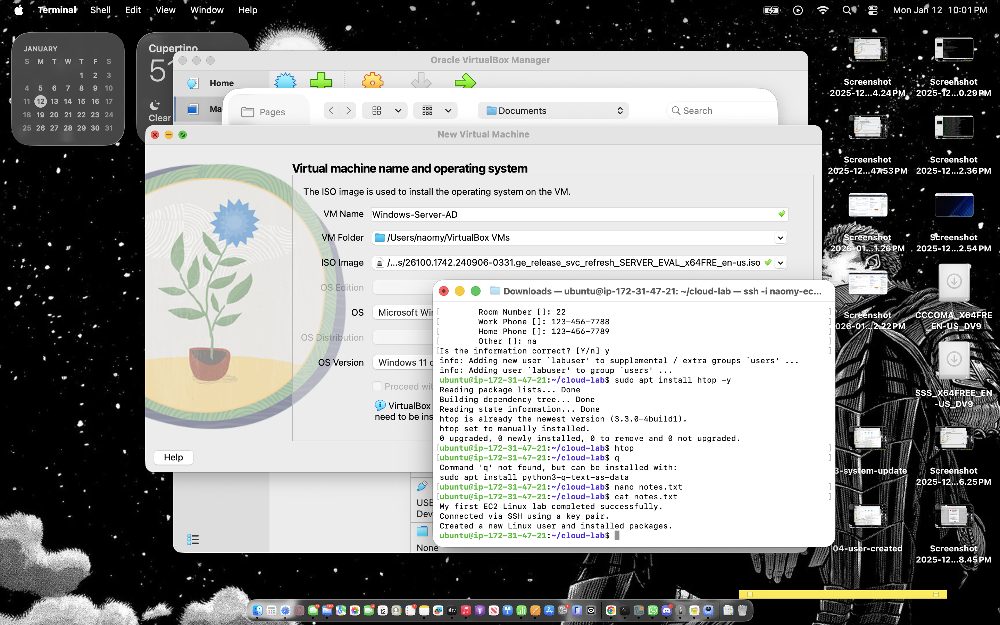
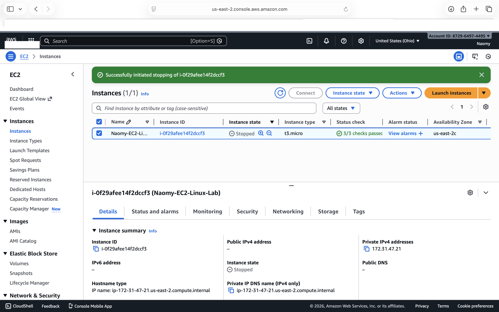

# aws-ec2-linux-lab
AWS EC2 Ubuntu Linux lab accessed via SSH from macOS terminal, showcasing secure access, Linux monitoring, and cost-controlled instance management.

# AWS EC2 Ubuntu Linux Lab (Free Tier)

## 📌 Overview
This repository documents a hands-on AWS lab where I deployed and managed a **running EC2 Ubuntu Linux instance**. I connected to the instance via **SSH from my macOS Terminal**, and all Linux administration commands were executed on the **remote Ubuntu Linux server**.

---

## 🧰 Tools & Services Used
- AWS EC2 (Free Tier)
- Ubuntu Linux (EC2 instance OS)
- Security Groups (SSH access control)
- SSH (remote access)
- macOS Terminal (local client)
- Linux CLI + htop
- GitHub (documentation)

---

## ✅ Screenshots 1–6 (Proof of Work)

### 1) Screenshot 1 — EC2 Instance Running


### 2) Screenshot 2 — Security Group Configuration (SSH)


### 3) Screenshot 3 — SSH Connected from macOS Terminal


### 4) Screenshot 4 — Linux Verification (Ubuntu on EC2)


### 5) Screenshot 5 — System Monitoring with htop


### 6) Screenshot 6 — EC2 Instance Stopped (Cost Control)


---

## 🧪 What I Did in AWS + On the Server

### In AWS (Console)
- Launched an Ubuntu EC2 instance (Free Tier eligible)
- Created/used a key pair for authentication
- Configured a Security Group to allow SSH (port 22)
- Verified instance state (Running → Stopped)

### On the Ubuntu Linux EC2 instance (via SSH from macOS)
- Verified Linux OS
- Updated packages
- Installed and used `htop` for monitoring

Example commands:
```bash
cat /etc/os-release
sudo apt update
sudo apt install htop -y
htop
